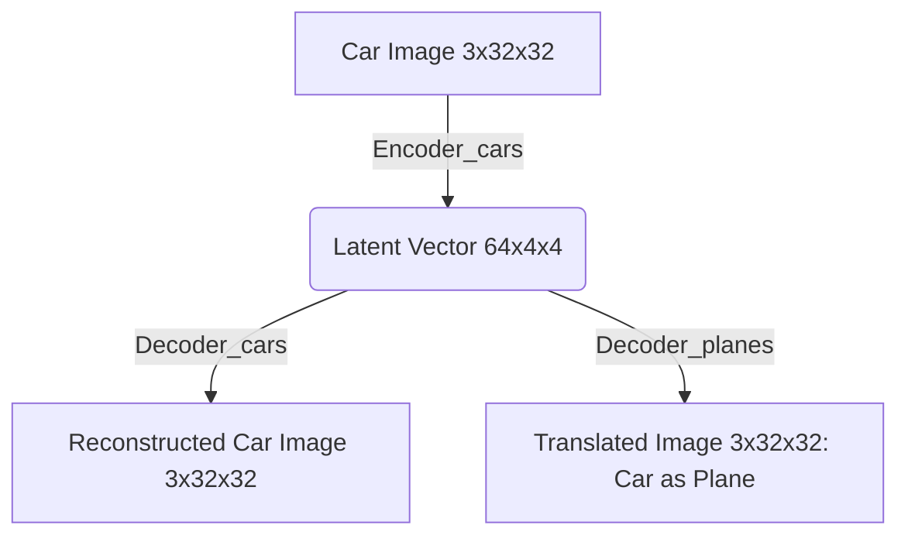
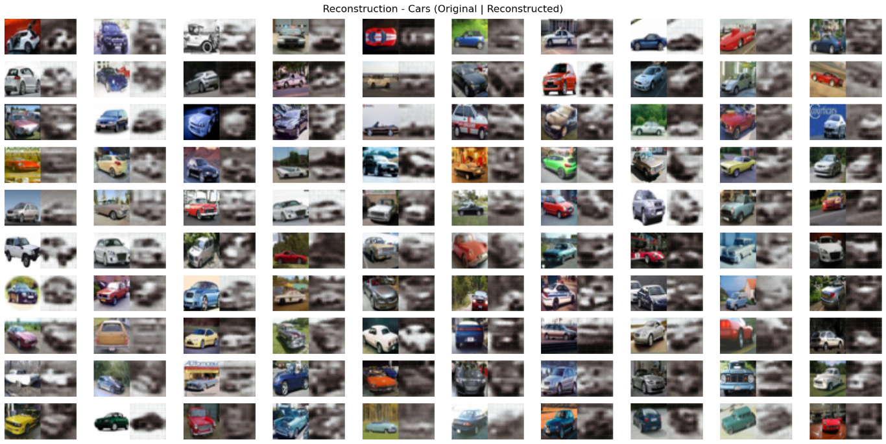
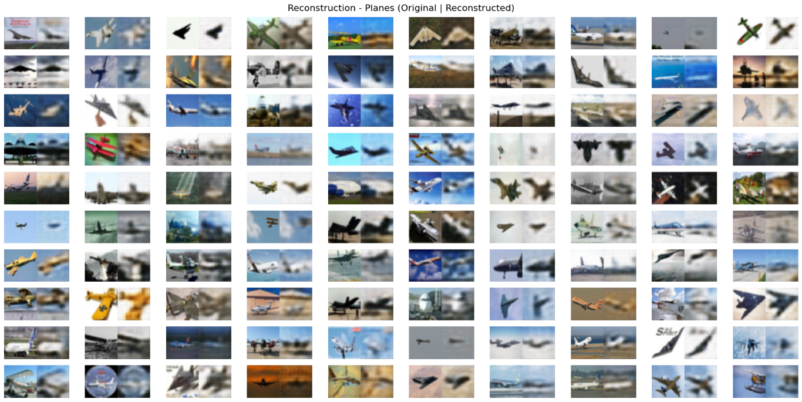
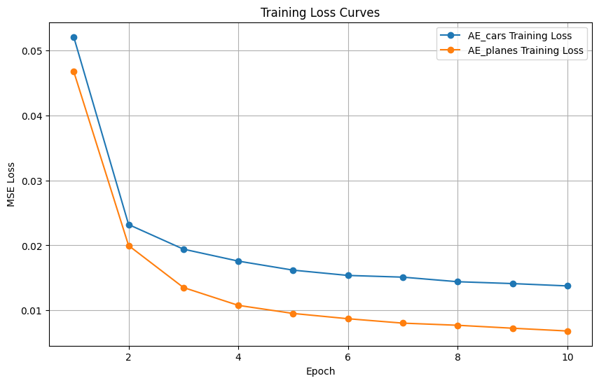
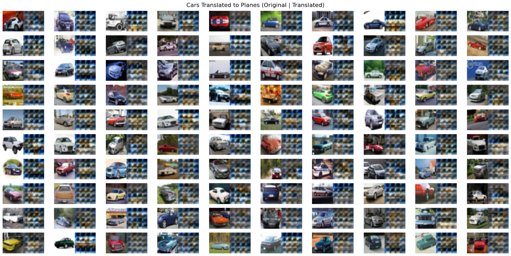
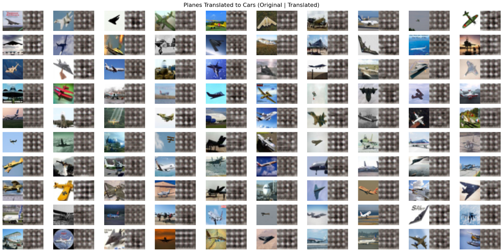

# Autoencoder Latent Space Translation (Cars ↔ Planes)

This project explores domain translation using Convolutional Autoencoders on the CIFAR-10 dataset. By training two distinct models to map images of cars and planes into separate, yet dimensionally equivalent latent spaces, we attempt to cross-pollinate their decoders to synthesize hybrid outputs.

## The Core Idea and Objectives

The primary objective of this project is to investigate what happens when the latent representation of one visual domain is decoded by a network trained exclusively on another visual domain. 

The approach involves:
1. **Filtering the Dataset:** Isolating the CIFAR-10 dataset into two distinct categories: 'cars' (class 1) and 'planes' (class 0).
2. **Independent Training:** Training two separate convolutional autoencoders (`AE_cars` and `AE_planes`). The car autoencoder learns a compressed representation (latent space) optimized only for cars, while the plane autoencoder learns a space optimized only for planes.
3. **The Swap (Latent Space Translation):** We take an image of a car, encode it using the `AE_cars` encoder to get its latent vector. We then pass this vector into the `AE_planes` decoder instead of the car decoder. Because both latent spaces share the exact same dimensionality (64x4x4), the math resolves successfully, forcing the plane decoder to "hallucinate" an image based on car-derived features.

## Process and Implementation Details

- **Framework**: Developed in PyTorch using a modular structure required by the `AI_EXPERT_COURSE` guidelines.
- **Data Processing**: Using `torchvision.datasets`, we conditionally extract subset indices where target labels match our desired classes (0 and 1). These subsets are wrapped in `DataLoader` instances with a batch size of 64.
- **Training Setup**: 
    - **Loss Function:** MSELoss (Mean Squared Error), minimizing the pixel-wise difference between the input image and the reconstructed output.
    - **Optimizer:** Adam with a learning rate of `1e-3`.
    - **Duration:** 10 epochs per domain model.

## Project Structure

```text
autoencoder_swap/
├── assets/                  # 10x10 grids and loss graphs
├── config.py                # Hyperparameters and device setup
├── datasets.py              # CIFAR-10 dataset filtering logic
├── evaluate.py              # PyPlot generation for reconstructions and swaps
├── main.py                  # Orchestrator
├── model.py                 # Encoder, Decoder, and Autoencoder nn.Modules
├── requirements.txt         # Dependencies
└── train.py                 # Training loop logic
```

## Data Flow / Architecture



**Network Architecture:**
- **Encoder**: 
  - `Conv2d(3, 16)` → ReLU → `Conv2d(16, 32)` → ReLU → `Conv2d(32, 64)` → ReLU.
  - All convolutions use `kernel_size=3`, `stride=2`, `padding=1` to progressively halve the spatial dimensions while doubling the channel depth.
- **Decoder**:
  - `ConvTranspose2d(64, 32)` → ReLU → `ConvTranspose2d(32, 16)` → ReLU → `ConvTranspose2d(16, 3)` → Sigmoid.
  - Transposed convolutions mirror the encoder, using `stride=2` and `output_padding=1` to upscale back to 3x32x32, with a final Sigmoid activation scaling pixel values to `[0, 1]`.

## Results

### Reconstruction - Cars (Original Left | Reconstructed Right)


### Reconstruction - Planes (Original Left | Reconstructed Right)


### Training Loss Curves


Both models demonstrate a steady decline in Mean Squared Error over 10 epochs. The loss curves have not fully plateaued, suggesting further training could yield marginally sharper reconstructions. At this stage, however, the autoencoders have successfully learned to approximate the shapes, colors, and backgrounds of their respective domains.

### Cross-Domain Translation Results

#### Cars translated to Planes (Original Car Left | "Translated Plane" Right)


#### Planes translated to Cars (Original Plane Left | "Translated Car" Right)


---

## Honest Assessment & Deep Analysis

While the standard reconstructions are adequate given the shallow architecture and brief 10-epoch training span, the **cross-domain latent space translation produced blurry, nonsensical artifacts** rather than clean interpolations.

### Why the translation behaves this way:

**1. Latent Spaces are Completely Unaligned**
`AE_cars` and `AE_planes` were trained entirely independently. As a result, the internal representation (the 64x4x4 tensor) learned by the car encoder maps identically to *nothing* in the plane decoder's learned distribution. The plane decoder receives mathematical noise relative to what it has been trained to interpret, so it defaults to producing smooth gradients or blurred shapes approximating the average pixel intensity of the plane dataset.

**2. No Distribution Enforcement (Like VAEs)**
Standard autoencoders encode inputs into absolute single points in space. Without a mechanism to force the latent space into a continuous, shared probabilistic distribution (like the KL-divergence penalty in a Variational Autoencoder), the latent points form disjoint clusters. Passing a "car point" to the "plane space" is essentially asking the decoder to sample from an empty void between data clusters.

**3. Blurriness from MSE**
Mean Squared Error intrinsically leads to blurry generations when uncertainty is high. Because the plane decoder doesn't recognize the latent input, the mathematical "safest bet" to minimize pixel-wise MSE error on unknown inputs is to output an average, amorphous blob. 

## Conclusion and What Needs to Be Done (Next Steps)

The project successfully proves the mechanics of encoder-decoder splitting and latent swapping, but mathematically proves why basic autoencoders fail at zero-shot domain translation. 

| Issue | Proposed Solution |
| :--- | :--- |
| Unaligned Latent Spaces | Implement adversarial training (e.g., CycleGAN) where a discriminator forces cycle-consistency across domains, ensuring the latent spaces map semantically. |
| Blurry Translations | Transition the architecture from a standard autoencoder to a **Variational Autoencoder (VAE)**. This forces the latent spaces to follow a standard Gaussian distribution, ensuring that any vector sampled maps back to a coherent image in either domain. |
| Limited Sharpness | Replace pixel-wise MSE loss with Perceptual Loss (comparing feature maps from a pre-trained VGG network) to prioritize sharp edges and textures over average color intensity. |

## Setup & Usage

### 1. Environment Creation (macOS / Linux)
```bash
python3 -m venv venv
source venv/bin/activate
pip install -r requirements.txt
```

### 1. Environment Creation (Windows)
```bash
python -m venv venv
venv\Scripts\activate
pip install -r requirements.txt
```

### 2. Execution
To run the full pipeline (download data, train models, and generate the 10x10 evaluation grids):
```bash
python main.py
```

## Dataset

This project utilizes the [CIFAR-10 dataset](https://www.cs.toronto.edu/~kriz/cifar.html), collected by Alex Krizhevsky, Vinod Nair, and Geoffrey Hinton. CIFAR-10 contains 60,000 32x32 color images in 10 different classes.
